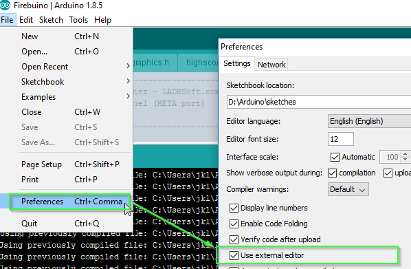

# Care for your (integrated development) environment!

Whoah, so much done already and still no line coded?! Yop, coding is not for wussies (80's styled games call for 80's styled words. yay.), we stay strong and do even more before actually coding something! We switch the Integrated Development Environment (IDE) for Arduino, since there is not much more pain in the ... backside .. than this IDE. Luckily it is easy to do that, just go into the settings of the arduino IDE and set it to "use external editor"

I only use the Arduino IDE for building and exporting the binaries, and even that is not needed after switching to something more useful: the Atom editor: https://atom.io/ It is lightweight and can be extended i.e. with Sorunomes arduino extension  (https://github.com/Sorunome/arduino-upload) - a small tool with the extra pony power (ba-da-ching!)! Of course you can use VSCode (https://gamebuino.com/creations/install-arduino-on-vscode) , use the arduino makefile project (https://github.com/sudar/Arduino-Makefile) or the Arduino IDE instead. Even MS Notepad can be used if you think nano or vi (not vim, vim is mainstream like emacs! :P) is too comfortable for you! But in that case you may not expect pitty from my side...

(Sidefact: since Atom and github are siblings, using github with the Atom is pretty easy. The cool guys and girls in our forum can tell you about it - but not me, though, since I am not cool and stick to Git Extensions :P ...)

So why is Atom fancy and the Arduino IDE is not?

Short version: many missing features, which will make your life easier, i.e. a search function also finding things where you only roughly know how you named them, customizable short cuts and most important of all: upgradeable with tons of plugins/packages. More details here: https://scotch.io/bar-talk/best-of-atom-features-plugins-acting-like-sublime-text

### Next: [Let - me - code!](LetMeCode.md)
