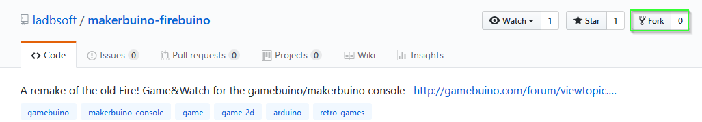

# Get the game:

So how to port a classic game?

Of course you have already read Auréliens tutorial, he wrote about this topic: https://gamebuino.com/creations/port-games-from-classic-to-meta

There you already find a huge stash of gamebuino classic games which wait for you to port them to the Meta.

But what is not mentioned there is that doing a full port is actually not much more complicated than the compatibility mode port - and as a side effect it does not maneuver you into a dead end since the compat and eeprom libraries there won't help you developing new games for the Meta.

Doing a full port means handling images by yourself, storing saves by yourself and doing your own music samples (or get free ones from one of the various websites).

But first, let's get the game:

https://github.com/ladbsoft/makerbuino-firebuino

Since you should always work with backups, git and in this case github allows you to protocol what you are doing and backtrace mistakes you made. This information is stored in a repository, like the one linked above. This is not a bonus for programming, but an essential part of projects with more than a few lines. This is not only relevant for programming but for other projects like diploma thesises and such, so investing a few minutes into learning the basics of version control systems are minutes well invested - see your older you just looks back to you at this moment and agrees with me completely! (Don't forget to check out Chris-scientists tutorial on github: https://gamebuino.com/creations/partagez-votre-projet-sur-github )

So go to github and create yourself an account, chop chop!

While you were getting your account, I already have forked the game by simply clicking on the fork button (marked green) and waiting a few seconds:

https://github.com/makerSquirrel/makerbuino-firebuino

Forking creates a full copy of the original game made by LADBsoft. Since he shared it with a LGPL licence I was allowed to fork it and modify the code.

After getting the game to my github account, I cloned it to my computer (which is just another fancy word for copying the repositories' content to your PC. The main difference between forking and cloning for you is that a fork copies the project and makes the copy your project, while a clone typically is made, when you intend to give something back to the repository. You can not give something back to LADBsofts original repository without him allowing you to do so, but in your fork, that's your beer now). Github gives you several nice ways to clone a project:

 (i.e. simply copy the command and put it into your bash on Linux, terminal on MacOs or whatever you have downloaded as a substitute on Windows). I like using Git Extensions (https://gitextensions.github.io/) for that and therefore show how to do it there:

A tool like git extension allows you to see all versions stored in the repository, allows me to compare any version with any other version, go back and forth in time, i.e. go back 3 versions, start changing stuff from the code back then, put it in its own timeline (called branch) and do whatever you like then. This you can do in command line as well, but here you get nice pictures and better explanations.

So to not overcomplicate things, let's simply use the tool to protocol our progress and to check changes. So no new branches are needed now, just the main branch, typically called "master"

So how does this fancy master branch look like? How should anyone care?

This is my current state of the firebuino project. In the bar at the top(1), I can see the (from left to right): refresh button, blue arrow for going to another repository (irrelevant for us), the filepath, the branch name (master), some more stuff we can currently ignore and the following really important things:

-   This tells me that I have untracked changes (2 files), which I can commit to my branch
-   with the blue arrow pointing upwards I can upload the files to github (called pushing), or get files from github (pulling, the arrow pointing downwards). In this tutorial, we will push a lot, but pulling is only relevant if more than one person is working on a project.

So what's so fancy about that?

See these red knobs connected on the red line near (2)? These are commits stored on the branch. These commits are like save games made while playing a game; let's say you have been running for hours through a dungeon and then you took a wrong turn without noticing and after another hour of playing you face a secret end boss while you being level 3 instead of level 99 and no potions are left? This is when you wished that you have saved back then. And now guess what, these commits do exactly that! They not only save the last state like a normal file save is doing, but any change you like, and you can give the saves names which tell you later what actually was saved!!! But it gets even better: near (5) you can see which files changed at selected commit, and near (6) it exactly tells you what changed compared to the previous commit!!!11oneleven! As you can guess from looking at the screenshot, you can even see each single step what LADBsoft did to be able to develop this game(!)  (btw, this commit information you got because you did clone the repo, including its history, not only downloaded the files)

Well, if you didn't get exited like me in the last paragraph, simply think of doing the dungen for days or even weeks after taking the wrong turn, without making any saves. I have been there, like many wretched programmer's souls before me (and some never came back). So please do your future self a favor and invest a few minutes in installing git extensions or a similar program.

And as a small sneak peek: there is even more awesome stuff you can do with git: [please pause here for a moment and think of your most favorite, off-screen narrator saying the following words with pathos] you can change history!!!

Although not only the physicists among you will now scream in rage, that it is not possible to travel back in time to change history, let me state here that with git you can; I will even prove you that in this tutorial!

but now, something completely different first:

### Next: [Care for your (integrated development) environment!](CareForYourIDE.md)
