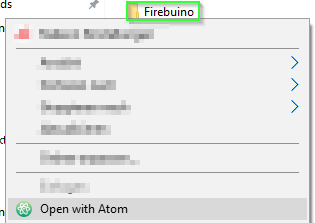
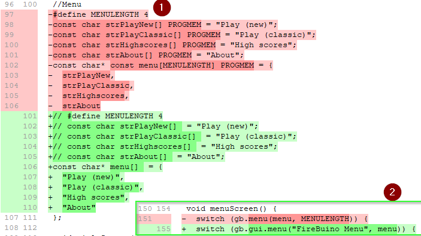
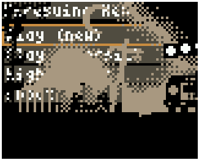

# Let - me - code!

**For those who want to follow my steps in detail: this chapter describes the commit:

*First compiling version, but still buggy (i.e. clear screen not used yet)

Had to fix:
- remove old library
- replace short/byte/boolean with int16_t/uint8_t/bool and so on
- replace LCDWIDTH and LCDHEIGHT with gb.display.width() and gb.display.height()
- replace old menu style with new one, see gamebuino reference for help
- replace BTN_ with BUTTON_ so that buttons work again
- comment out everything that has something to do with scores.***

Finally we can start working with the code files: we copy the FIRBUINO.ino file and the graphics.ino into a new directory called Firebuino, then we rename FIRBUINO.ino to Firebuino.ino (same name as directory, which stops Arduino IDE from complaining).

Then let's start the Atom editor, where we conveniently open not the ino file, but the full directory:

The easiest way to do this the first time is to start Atom and open the folder, which loads all files in it:



before starting to code anything new, let's do some easy search-and-replace steps where we replace several snippets with more correct ones:

- `byte -> uint8_t` [`byte` is not official C++ and I always forget if it is signed or unsigned, so replace it with a type that is less nice to look at, but more informative]
- `short -> int16_t` [`short` is short for `short int`, but again it is nicer to know for sure that it is an 16 bit integer]
- `boolean -> bool` [`boolean` is arduino jargon again, whyever someone thought it is better than `bool`, beats me...]
- `PROGMEM -> `[nothing, no one needs `PROGMEM` on an ARM CPU!]
- `BTN_ -> BUTTON_` [this converts all button macros to the META compatible versions]

Then we start with some actual porting, just do what STUDIOCRAFTapps wrote in the WHEN PORTING OVER TO META section of his tutorial: https://gamebuino.com/creations/facepalm-center .

Hey, we replaced the includes (don't forget to add `#include <Gamebuino-Meta.h>`), removed the `gb.titlescreen()` and `gb.battery.show()`, so are we done now? can we go home and be proud?

Nope.

We have to remove all the highscore related stuff yet, since it uses EEPROM (this is how the classic stored its game saves) which - as mentioned in the facepalm center - does not work on the Meta anymore. For now, just comment out all lines within the functions containing "highscore" in their name. (Funfact: Firebuino - like many classic games - just used R0d0t/Auréliens Crabator code for the Highscore. This is neat for us, since we have to solve the highscore-riddle only once and then can recycle the solution over and over).

Then we have to add the `LCDWIDTH` and `LCDHEIGHT` macros again (or better: replace all macros with the actual function calls).

```C++
#define LCDHEIGHT gb.display.height()
#define LCDWIDTH gb.display.width()
```

After that we have to convert the old menu to a working one. I show that with the diff-tool which is part of git extension, the red parts starting with a minus sign are the old code parts, the green ones starting with a plus sign are the new ones and the white ones will stay untouched:



My version then already compiled at that point and could be tested using aoneills online emulator: http://games.aoneill.com/meta-emulator/

This made clear another difference between the classic and the meta: `gb.display.clear();` must be called in the loop function to clear the screen.

Compiling means it is done, yes?

No. The real work starts now!

(Well actually after we save what he have achieved so far, phew!)

Now it is time to do a commit in git. For that simply open git extensions again, where you see something like   in the tool bar, click on it and then you see all files listed which have changed (the changes you can see in the green(new)/red(old) lines on the right hand side), simply write an explaining message in the field on the lower right and press the small violet arrow icon on the left side labelled stage all. This means that you want to store all file changes in this commit (click the single stage button if you do not want to add all files). after that you can commit and that's it, you have saved your state!

If you want to compare your state with mine, simply clone my github repository () using git extension, so that you get my full history and compare the commit labelled as "First compiling version, ..." with your results!

My version already started back then, but it was not playable:



The reason why one can see the menu and the game at the same time here is that I forgot to add the clear screen line in the loop of the game:
```C++
gb.display.clear();
```

### Next: [Step2: get a debug version running!](step2GetDebugVersionRunning.md)
