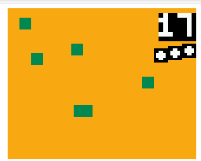

# Step2: get a debug version running!

**For those who want to follow my steps in detail: this chapter describes the commit:
*Step2: get a debug version running!*
on the portintTutorial branch!**

After getting the code to compile one can start getting some structure in the code.
One of the tedious things encouraged by the Arduino world is putting everything in one file, which leads to hundreds or thousands lines of code, making it difficult to find anything again.
I therefore typically start moving stuff in dedicated files as soon as possible.
If you have checked out my revision for Step2, you see that I have started adding a global file collecting some global constants (this is actually discouraged for real C++ programming, but in here it helps to deal with a more Arduino-like structure).
I additionally renamed the graphics.ino to graphic.h. Using ino files instead of .h and .cpp leads to slower compiling time (since the Arduino parser smashes all ino files in one file before starting to compile. This is actually true for .h files as well, but we can move stuff to .cpp files later) and leads to some annoying issues one can happily run into oneself (i.e. the fact that the ino files are added in alphabethical order, not in the order of includes), but I digress...

So what did I do here? I removed practically all images, replaced the baground with orange, the survivors and the firemen with green rectangles and played around a bit with the positioning of the score and the live-markers. Et voilà, one already can play an ugly version of firebuino!

# Next: [Where do we go from here?](WhereDoWeGo.md)
